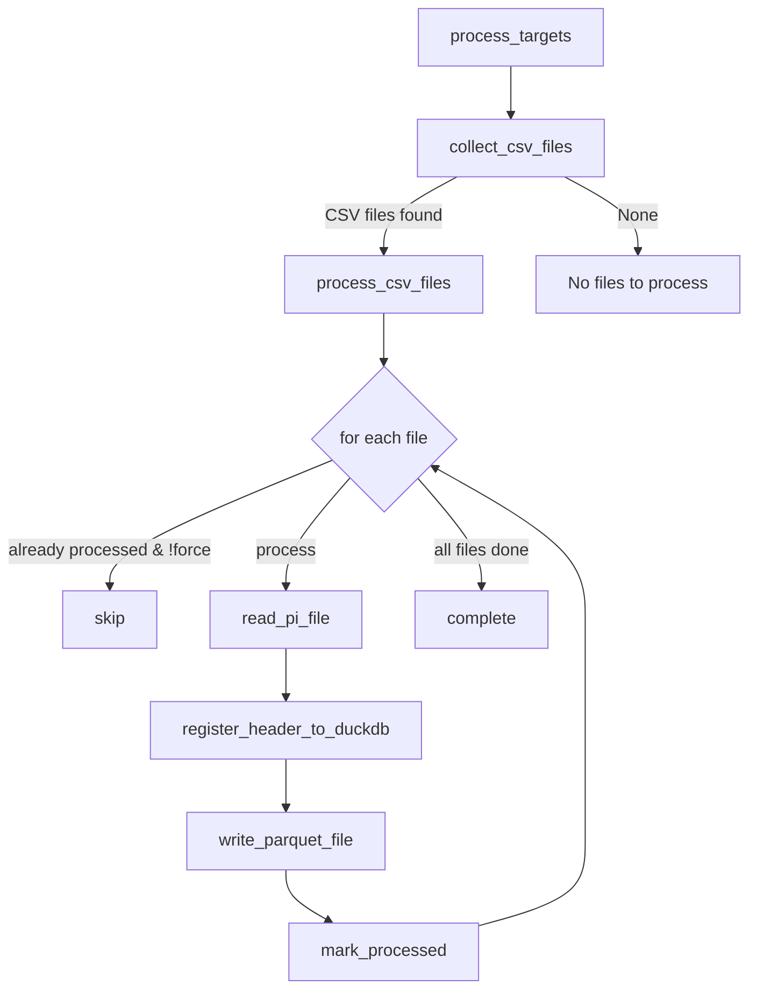

- ### Memo
	- Obsidian
		- Chrome拡張
			- Web Cliper
		- Comunity 
			- Smart Composer AI利用
			- Text Generator
			- Kindle Highlights
		- Core Plugin
	- Notion
	- OneNote
- ### AI
	- [Chat GPT](https://chatgpt.com/)
	- [Claude](https://claude.ai/new)
	- [NotebookLM](https://notebooklm.google.com/)
	- [GenSpark](https://www.genspark.ai/)
		- AI Slide

