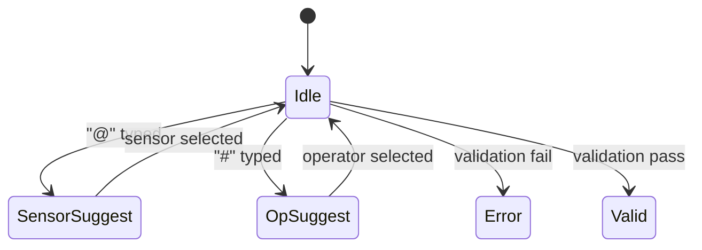

## フォーミュラエディタ UI／UX設計仕様

*— コーディングエージェントへのインプット用 —*

---

### 1. 目的

* **既存センサー項目 ＋ 定数／演算子 を組み合わせて“計算式”を作成**し、時系列グラフの不足パラメータを補う。

* **ミスタイプ防止・大量センサー検索性向上**のため、“@”をトリガーに検索付きドロップダウン (Combobox) でセンサーを挿入する。

### 2. ユースケース & ストーリ

| ID | ユーザーストーリ | 受入れ条件 (Done) |

| -- | ------------------------------------------- | --------------------------------- |

| U1 | エンジニアが計算式入力欄に `@` を打つと、センサー候補が検索付きで表示される | ドロップダウンは最大20件／ページネーション or 無限スクロール |

| U2 | 候補を↑↓キーまたはマウスで選択し⏎すると**チップ化**して式に挿入される | チップにセンサー名＋色ラベル、ホバーでフルパス表示 |

| U3 | `#` を打つと演算子／括弧のショートカットメニューが表示される | `+ - * / ( ) ^` などがクリックで入力 |

| U4 | Enter または「✔︎保存」で構文チェック → OK なら JSON にシリアライズ | 構文 NG は赤枠＋ツールチップでエラー理由 |


### 3. 主要インタラクション・状態遷移



### 4. キーボード操作

| 操作 | 動作 |

| ------------------- | ----------------- |

| `@` | SensorComboBox 開く |

| `#` | OperatorMenu 開く |

| `↑ / ↓` | 候補移動 |

| `Enter` | 候補確定 or 改行 |

| `Backspace` on Chip | チップ削除 (二度押しで物理削除) |

### 6. バリデーション仕様

* **字句解析**: トークン列 `[SensorChip|Number|Operator|Paren]` を走査

* **構文解析**: プレディクティブパーサ (再帰下降) ／エラー位置返却

* **結果**:

```ts

type FormulaAST = BinaryExpr | SensorRef | NumericLiteral

interface SensorRef { sensorId: string; alias?: string }

```

* **サーバー送信ペイロード例**

```json

{

"formula": "@A - @B",

"ast": {

"type": "BinaryExpr",

"op": "-",

"left": { "type": "SensorRef", "sensorId": "A" },

"right": { "type": "SensorRef", "sensorId": "B" }

}

}

```

### 7. 非機能要件

| 項目 | 内容 |

| -------- | ------------------------------------ |

| パフォーマンス | 候補検索 API 応答 < 300 ms (センサー数 ≒ 50k) |

| アクセシビリティ | ARIA role=combobox／listbox, Tab ナビ対応 |

| i18n | センサー名は DB 多言語カラム (ja/en) で表示切替 |

### 8. 画面レイアウト (概略)

```

+---------------------------------------------------------+

| 計算式エディタ (FormulaEditor) |

| ┌──────────────────────────────────────────────┐ |

| │ @燃焼温度 - @排ガス温度 * 1.25 │ |

| │ │ |

| └──────────────────────────────────────────────┘ |

| |

| 構文 ✓ プレビュー: ΔT = 120 ℃ |

+---------------------------------------------------------+

```

### 9. 実装タスク分割（開発工数見積りの目安）

1. **基盤構築**: Slate.js 拡張で Token ノード定義 (1.5 d)

2. **@ センサー検索**: API, Combobox, Chip 挿入 (2 d)

3. **# 演算子メニュー**: ポップアップ実装 (0.5 d)

4. **バリデーション & AST 生成** (1.5 d)

5. **スタイル調整 & アクセシビリティ** (0.5 d)

6. **単体 & 結合テスト** (1 d)

計 **\~7 日**（1 dev ベース）

---

この仕様をそのままコーディングエージェントへ渡せば、フロントエンド実装へ着手できます。ご要望の追加・修正があればお知らせください。